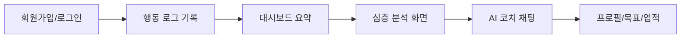

# Mindflow (Mini_ChatBot)

> **행동 로그 x 감정 패턴 분석 x AI 피드백 코치**  
> FastAPI + React 기반으로 개인 행동 데이터를 기록하고, 패턴을 시각화하고, AI 코칭까지 연결한 풀스택 프로젝트


---

## 한눈에 보기

| 항목 | 내용 |
| --- | --- |
| **프로젝트 성격** | 행동/감정 기록 기반 개인 생산성 분석 서비스 |
| **핵심 사용자 경험** | 기록 → 대시보드/분석 → AI 채팅 코치 → 프로필/목표 추적 |
| **핵심 기술** | FastAPI, SQLAlchemy, JWT 인증, Gemini 연동(옵션), React 19, Recharts |
| **중점 구현** | 라우트 권한 보호, 패턴 분석 엔진, UI 전용 API 계층, 다국어/테마 지원 |
| **운영 모드** | Gemini 키가 없어도 fallback 분석 텍스트로 전체 흐름 동작 |

---


## ⚡ Quick Start

```bash
git clone <your-repo-url>
cd Mini_ChatBot

# backend
python -m venv .venv
source .venv/bin/activate  # Windows: .venv\Scripts\activate
pip install -r requirements.txt
uvicorn backend.main:app --reload

# frontend
cd frontend
npm install
npm run dev
```

---

## 📸 Screenshots

> 실제 캡처 이미지는 아래 경로에 추가하면 README에서 바로 노출됩니다.

### Dashboard


### Analysis


### Chat


## 🎥 Demo
- Local Demo: http://127.0.0.1:5173

---

## 🔥 What makes this different?

- UI 전용 API 계층(`/api/ui`) 설계로 프론트 결합도 감소
- AI 미사용 환경에서도 fallback 분석으로 UX 유지
- 행동 로그 → 분석 → 채팅 코칭까지 연결된 end-to-end 루프 설계

> This project separates domain APIs and UI APIs to reduce frontend complexity and improve scalability.

---

## 🧠 Challenges & Solutions

### 1) React 렌더링 안정성 이슈
- 문제: 화면 데이터 구조가 바뀌거나 비어있을 때 렌더링 실패 가능성이 존재
- 해결: `Outlet context` + fallback 데이터(`FALLBACK_OVERVIEW`) + 조건부 렌더링으로 안전한 표시 패턴 적용

### 2) API 네트워크 불안정
- 문제: Axios 네트워크 에러 발생 시 원인 파악이 어렵고 UX가 급격히 저하됨
- 해결: request/response interceptor + 에러 분류(`response/request/setup`) + 사용자 친화 메시지 처리(`getErrorMessage`) 도입

### 3) bcrypt/패스워드 해시 호환성
- 문제: 런타임 환경에 따라 passlib+bcrypt 조합에서 해시 검증 이슈가 발생할 수 있음
- 해결: `pbkdf2_sha256`를 기본 해시로 사용하고 `bcrypt`는 legacy 검증 용도로 유지해 인증 안정성 확보

---

## 1. 프로젝트 개요

### 문제 정의

행동 개선 도구는 보통 다음 중 하나에 치우치는 경우가 많습니다.

- **기록만 가능한 앱**: 데이터는 쌓이지만 인사이트가 약함
- **분석만 강조한 앱**: 사용자가 입력하기 불편해 데이터 품질이 낮아짐

### Mindflow에서 시도한 방향

**"입력 장벽은 낮추고, 인사이트 밀도는 높이는" 흐름**으로 구성했습니다.

1. 사용자가 짧은 행동 로그를 빠르게 쌓는다.
2. 백엔드가 감정/시간대/태그 패턴을 계산한다.
3. 대시보드·분석·채팅·프로필 화면에 목적별 데이터로 재구성한다.
4. AI 연동이 없더라도 fallback 코칭 텍스트로 경험이 끊기지 않게 한다.

---

## 2. 핵심 사용자 흐름



### 페이지별 역할

- **Auth**: 이메일/아이디 기반 가입/로그인 + JWT 발급
- **Log**: 카테고리, 감정, 시간 포함 행동 기록 생성
- **Dashboard**: 주간 핵심 카드 + 타임라인 + 감정 추이 + 최근 활동
- **Analysis**: 분포/레이더/추천 액션 중심 심층 분석
- **Chat**: 분석 기반 질의응답형 코칭
- **Profile**: 활동 통계, 주간 목표, 업적 시각화

---

## 3. 기술 아키텍처

```mermaid
flowchart TD
    U[User] --> FE[React 19 + Vite Frontend]
    FE --> API[FastAPI Backend]
    API --> DB[(SQLite / MySQL)]
    API --> PA[PatternAnalysisService]
    API --> AI[AIFeedbackService]
    AI --> GEM[Google Gemini API (optional)]
```

### 레이어 구성

| 레이어 | 구현 |
| --- | --- |
| **Frontend** | React Router 기반 멀티페이지, Axios API 클라이언트, Recharts 시각화 |
| **Backend API** | FastAPI 라우터 분리(`auth`, `behaviors`, `analysis`, `ui`, `users`) |
| **Domain Model** | `User`, `BehaviorLog` 중심의 관계형 모델 |
| **Analysis Engine** | 감정 비율/강도 평균/트렌드/리스크 패턴 계산 |
| **AI Layer** | Gemini 호출 + 실패/미설정 대비 fallback 생성 |
| **Auth/Security** | JWT Bearer 인증, 사용자 본인 데이터 접근 제한 |

---

## 4. 백엔드 심층 분석

## 4-1. 라우터 설계

### `auth` 라우터
- `POST /api/auth/signup`: 계정 생성 + 토큰 발급
- `POST /api/auth/login`: 이메일/아이디 로그인 + 토큰 발급
- `GET /api/auth/me`: 현재 로그인 사용자 조회

### `behaviors` 라우터
- `POST /api/behaviors/{user_id}`: 행동 로그 생성
- `GET /api/behaviors/{user_id}`: 사용자 로그 목록(최대 100)
- `GET /api/behaviors/{user_id}/{log_id}`: 단건 조회
- `PUT /api/behaviors/{user_id}/{log_id}`: 수정
- `DELETE /api/behaviors/{user_id}/{log_id}`: 삭제

### `analysis` 라우터
- `POST /api/analysis/{user_id}`: N일 기준 패턴 분석 + AI 피드백 결합

### `ui` 라우터 (프론트 전용 응답 계층)
- `GET /api/ui/{user_id}/overview`
- `GET /api/ui/{user_id}/analysis`
- `GET /api/ui/{user_id}/profile`
- `GET /api/ui/{user_id}/chat/bootstrap`
- `POST /api/ui/{user_id}/chat`

> 포인트: 단순 CRUD API 위에 **UI ViewModel API 계층**을 추가해 프론트 조합 비용을 낮춘 구조입니다.

## 4-2. 분석 엔진 로직

`PatternAnalysisService`는 아래를 계산합니다.

1. **BehaviorPattern**: 감정별 빈도/비율/평균 강도
2. **EmotionalTrend**: 감정별 강도 추세(증가/감소/안정)
3. **RiskyPattern**:
   - 부정 감정 고빈도 + 고강도
   - 연속 로그 강도 급변(감정 변동성)
   - 특정 위험 태그(self_harm 등) 감지

## 4-3. AI 피드백 전략

- `GOOGLE_API_KEY` 존재 시 Gemini 모델 호출
- 미설정/실패 시 자동 fallback 텍스트 생성
- 따라서 로컬/데모 환경에서도 기능 단절 없이 분석 결과 제공

## 4-4. 인증/권한 제어

- JWT(`HS256`) 기반 토큰 인증
- `require_same_user` 의존성으로 path user_id와 토큰 주체 일치 강제
- 타 사용자 로그 접근 차단(403)

## 4-5. 데이터베이스 유연성

- 기본: SQLite (`mini_chatbot.db`)
- 옵션: MySQL (`DATABASE_URL` 설정)
- 비SQLite 연결 실패 시 SQLite fallback 엔진 생성

---

## 5. 프론트엔드 심층 분석

## 5-1. 화면 구조

- `AppLayout`에서 토큰 존재 여부로 인증 게이트
- `useAppData` 훅이 부트스트랩, 시드 로그 생성, 오버뷰 초기화 담당
- 각 페이지는 필요 데이터만 추가 fetch하여 관심사 분리

## 5-2. UX 설계 포인트

- **Log 페이지**: Quick Action + 커스텀 시간 입력으로 입력 마찰 최소화
- **Dashboard/Analysis**: "요약 카드 + 시각화 + 액션" 패턴 반복
- **Chat**: 추천 프롬프트 제공으로 질문 시작 비용 절감
- **Profile**: streak/goal/achievement로 지속 기록 동기 유도

## 5-3. 상태/환경 처리

- Axios 인터셉터로 토큰 자동 주입
- 공통 에러 메시지 파서로 네트워크/검증/서버 오류를 사용자 친화 문구로 변환
- 언어(`en/ko`), 테마(`light/dark`)를 localStorage로 지속화

---

## 6. API 요약

| 영역 | Method | Endpoint | 설명 |
| --- | --- | --- | --- |
| Auth | POST | `/api/auth/signup` | 회원가입 + 토큰 발급 |
| Auth | POST | `/api/auth/login` | 로그인 + 토큰 발급 |
| Auth | GET | `/api/auth/me` | 내 정보 조회 |
| Behaviors | GET | `/api/behaviors/{userId}` | 로그 목록 조회 |
| Behaviors | POST | `/api/behaviors/{userId}` | 로그 생성 |
| Analysis | POST | `/api/analysis/{userId}` | 기간 기반 패턴 분석 |
| UI | GET | `/api/ui/{userId}/overview` | 대시보드 데이터 |
| UI | GET | `/api/ui/{userId}/analysis` | 분석 화면 데이터 |
| UI | GET | `/api/ui/{userId}/profile` | 프로필 화면 데이터 |
| UI | GET/POST | `/api/ui/{userId}/chat*` | 채팅 부트스트랩/응답 |

---

## 7. 로컬 실행 가이드

## 7-1. 백엔드 실행

```bash
python -m venv .venv
source .venv/bin/activate  # Windows: .venv\\Scripts\\activate
pip install -r requirements.txt
uvicorn backend.main:app --reload --host 0.0.0.0 --port 8000
```

- API docs: `http://127.0.0.1:8000/docs`

## 7-2. 프론트엔드 실행

```bash
cd frontend
npm install
npm run dev
```

- Frontend: `http://127.0.0.1:5173`

## 7-3. MySQL 사용(선택)

```bash
docker compose up -d
```

그 후 `DATABASE_URL`을 MySQL DSN으로 지정하면 백엔드가 MySQL을 사용합니다.

---

## 8. 환경 변수

| 변수명 | 기본값 | 설명 |
| --- | --- | --- |
| `DATABASE_URL` | `sqlite:///./mini_chatbot.db` | DB 연결 문자열 |
| `DATABASE_ECHO` | `False` | SQL 로깅 여부 |
| `GOOGLE_API_KEY` | 빈 값 | Gemini 연동 키(옵션) |
| `JWT_SECRET_KEY` | `change-this-in-production` | JWT 서명 키 |
| `APP_NAME` | Behavior Pattern Analysis Chatbot | 앱 이름 |
| `APP_ENV` | development | 실행 환경 |
| `LOG_LEVEL` | INFO | 로깅 레벨 |

---

## 9. 트러블슈팅 & 설계 판단

- **AI 의존성 단절 위험** → Gemini 미사용 시 fallback 코칭으로 대체
- **권한 실수 위험** → 모든 사용자 데이터 라우트에 `require_same_user` 적용
- **프론트 결합도 증가 위험** → `ui` 라우터로 화면 친화 응답을 별도 제공
- **온보딩 공백 위험** → `ensureSeedLogs`로 첫 사용자도 즉시 차트 확인 가능

---

## 10. 향후 개선 아이디어

- 테스트 코드(서비스/라우터) 보강 및 CI 자동화
- 감정 라벨 사전/정규화 로직 고도화
- 관리자/코치 역할 분리 및 다중 사용자 협업 기능
- 분석 결과 히스토리 비교(주차별 diff)
- 실시간 알림(WebSocket/SSE) 기반 코칭 리마인더

---

## 프로젝트 구조

```text
Mini_ChatBot/
├── backend/
│   ├── main.py
│   ├── auth.py
│   ├── config.py
│   ├── database.py
│   ├── models/
│   ├── routers/
│   ├── schemas/
│   └── services/
├── frontend/
│   ├── src/
│   │   ├── api/
│   │   ├── pages/
│   │   ├── components/
│   │   ├── context/
│   │   └── hooks/
│   └── package.json
├── docker-compose.yml
└── requirements.txt
```

---

<div align="center">

**Mindflow (Mini_ChatBot)** · 기록을 패턴으로, 패턴을 행동 변화로 연결하는 실험

</div>
